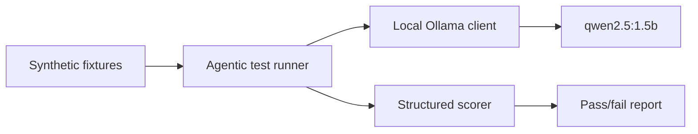

# Synthetic LLM Testing Plan

## Goal

Validate whether a local model such as `qwen2.5:1.5b` running through Ollama is good enough for basic assistant behaviors before connecting to real mail or calendar APIs.

The first target is not full autonomy. The first target is reliable structured extraction and safe tool suggestion in a synthetic environment.

## Evaluation layers

## What to test

### 1. Mail parsing

Feed synthetic emails and ask for:

- sender and recipient extraction
- subject and urgency classification
- date/time normalization
- action item detection
- whether a follow-up tool call is needed

### 2. Calendar extraction

Feed invitation-like text and ask for:

- event title
- start/end times
- recurrence rules if present
- conflict detection hints
- final structured event object

### 3. Event logging

Feed user activity text and ask for:

- normalized event type
- metadata payload
- log severity / priority
- idempotency key if needed

### 4. Robustness

Test malformed inputs, missing dates, noisy signatures, mixed languages, and spam-like text.

## Suggested architecture in this repo

### Runtime boundary

Keep a small orchestrator layer in `services/llm_orchestrator/`.

That layer should own:

- the Ollama transport client
- prompt templates
- tool schema serialization
- response parsing and validation

### Synthetic evaluation layer

Keep all fake data and scoring in `tests/agentic/`.

That layer should own:

- fixture loading
- scenario definitions
- prompt generation
- JSON validation
- score aggregation

### Side-effect adapters

Keep anything that would talk to Gmail, Outlook, calendars, or webhooks behind adapters in `services/actions/`.

For now, those adapters should be mocked or stubbed in synthetic tests.

## Suggested repo cleanup

Use this as the clean starting point:

- keep `services/llm_orchestrator/`, `services/actions/`, `services/rag_store/`, `services/identity/`, and `services/sensing/`
- keep `tests/agentic/` and `tests/synthetic_data/`
- remove malformed placeholder names that contain commas or empty starter files
- replace the old doc fragments with one clear architecture doc and one clear testing doc

## Basic test flow

1. Start Ollama locally.
2. Pull the model.
3. Run the synthetic harness.
4. Inspect JSON parsing failures first.
5. Fix prompt shape or schema handling.
6. Re-run until the failure rate is acceptable.
7. Only then connect real APIs.

## Skeleton implementation

The repo now has a minimal code path under `tests/agentic/` that can be extended into a proper harness. It is intentionally small so that you can swap in richer scoring or tool-calling logic later without rewriting the whole test structure.
